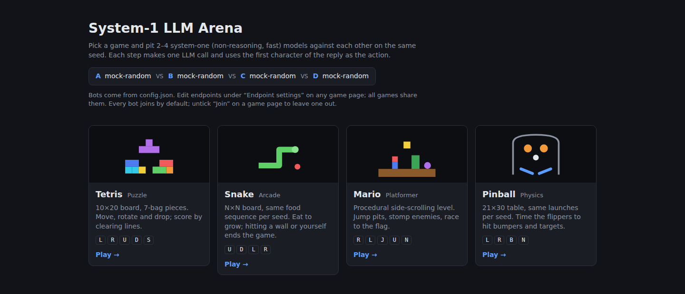
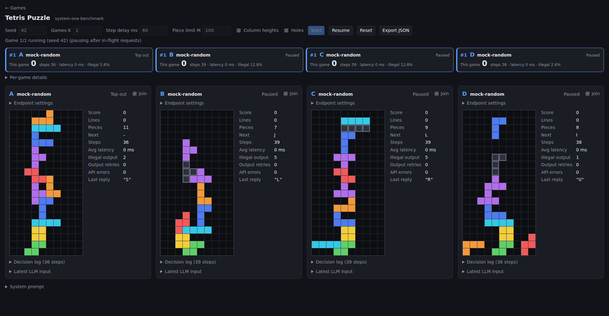
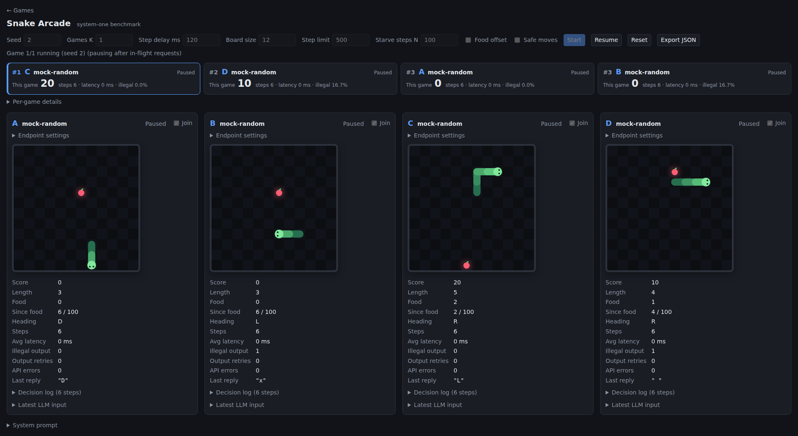
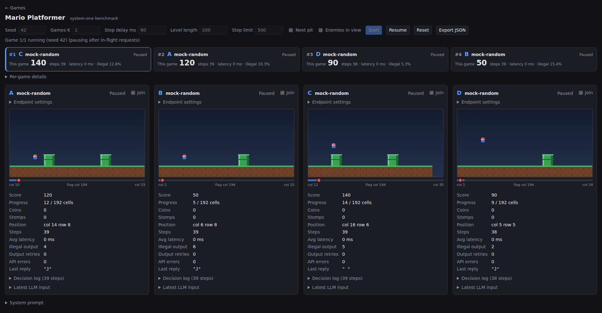
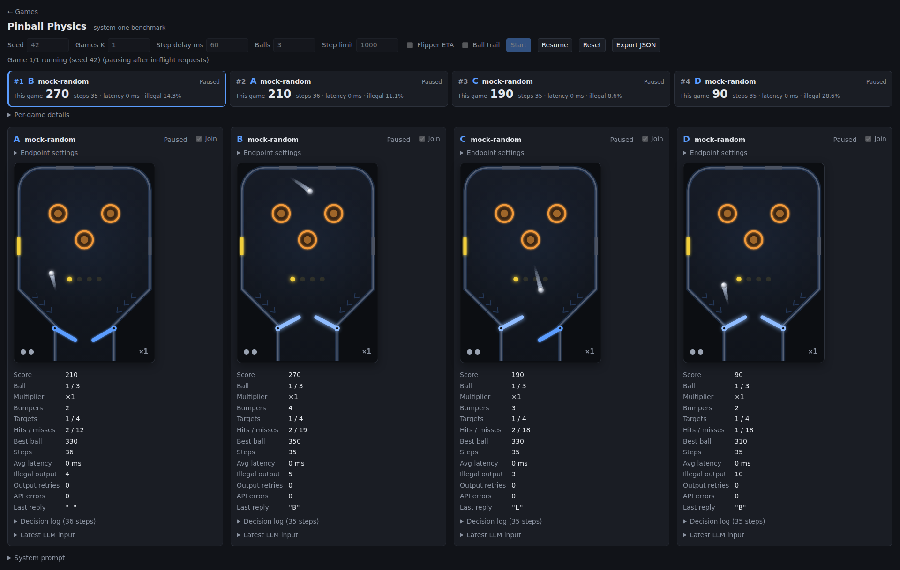

# System-1 LLM Arena

Pits system-one (non-reasoning, fast) LLMs against each other in small games. Each bot (up to four, panes A–D) gets its own board; all boards run at once with the same seed. Each step makes one LLM call per bot and uses the first character of the reply as the action.



## Quick start

Requires [Bun](https://bun.sh) 1.3+; no packages to install.

```bash
cp config.example.json config.json   # set each bot's endpoint, api_key, model
bun start                            # http://127.0.0.1:3000
bun test                             # engine unit tests
```

Or with Docker: `docker compose up -d --build` (see [Docker](docs/docker.md)).

## Games

Four bots, four boards, one seed: every pane gets the same pieces, food, level or launches, so scores are directly comparable.

<table>
  <tr>
    <td width="50%" valign="top">
      <h3><a href="docs/tetris.md">Tetris</a></h3>
      <a href="docs/tetris.md"></a>
      <p><code>tetris</code> · <code>L</code> <code>R</code> <code>U</code> rotate, <code>D</code> down, <code>S</code> hard drop</p>
    </td>
    <td width="50%" valign="top">
      <h3><a href="docs/snake.md">Snake</a></h3>
      <a href="docs/snake.md"></a>
      <p><code>snake</code> · <code>U</code> <code>D</code> <code>L</code> <code>R</code></p>
    </td>
  </tr>
  <tr>
    <td width="50%" valign="top">
      <h3><a href="docs/mario.md">Mario-style platformer</a></h3>
      <a href="docs/mario.md"></a>
      <p><code>mario</code> · <code>R</code> <code>L</code> <code>J</code> jump right, <code>U</code> jump up, <code>N</code> stay</p>
    </td>
    <td width="50%" valign="top">
      <h3><a href="docs/pinball.md">Pinball</a></h3>
      <a href="docs/pinball.md"></a>
      <p><code>pinball</code> · <code>L</code> <code>R</code> <code>B</code> both flippers, <code>N</code> none</p>
    </td>
  </tr>
</table>

<sub>Screenshots show <code>mock://random</code> bots mid-match; click one for the game's rules.</sub>

## Docs

- [Endpoint configuration](docs/endpoints.md): chat completions, text completions, OpenRouter Decisions API, env vars and `config.json`
- [Match rules and UI](docs/match.md): scoreboard, parsing, ranking, retries and errors
- [Exported JSON](docs/export.md): match export format
- [Docker](docs/docker.md): Compose and plain `docker run`
- [Development](docs/development.md): file layout and adding a game
